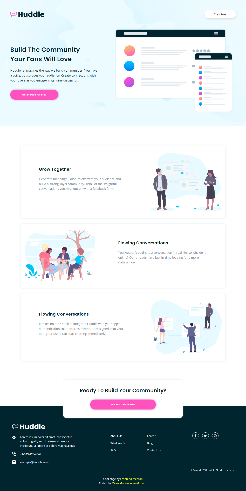
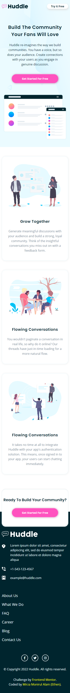

# Frontend Mentor - Huddle landing page with alternating feature blocks solution

This is a solution to the [Huddle landing page with alternating feature blocks challenge on Frontend Mentor](https://www.frontendmentor.io/challenges/huddle-landing-page-with-alternating-feature-blocks-5ca5f5981e82137ec91a5100). Frontend Mentor challenges help you improve your coding skills by building realistic projects.

- 16 April 2022

## Table of contents

- [Screenshot](#screenshot-desktop)
- [Screenshot](#screenshot-mobile)
- [Links](#links)
- [Built with](#built-with)
- [Author](#author)
- [Date](#date)

## Screenshot (Desktop)

## Screenshot (Mobile)

## Links

- Solution URL: [Solution](https://www.frontendmentor.io/solutions/huddle-landing-page-with-react-rksPgj545)
- Live Site URL: [Live](https://ethenpage.github.io/huddle-landing-page/)

## Built with

- [React](https://reactjs.org/) - JS library

## Author

- Name - Mirza Monirul Alam (Ethen)
- Frontend Mentor - [EthenPage](https://www.frontendmentor.io/profile/ethenpage)

## Date

- 16 April 2022
